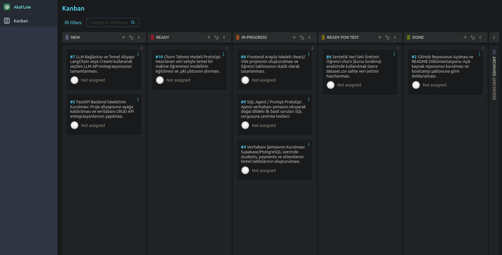
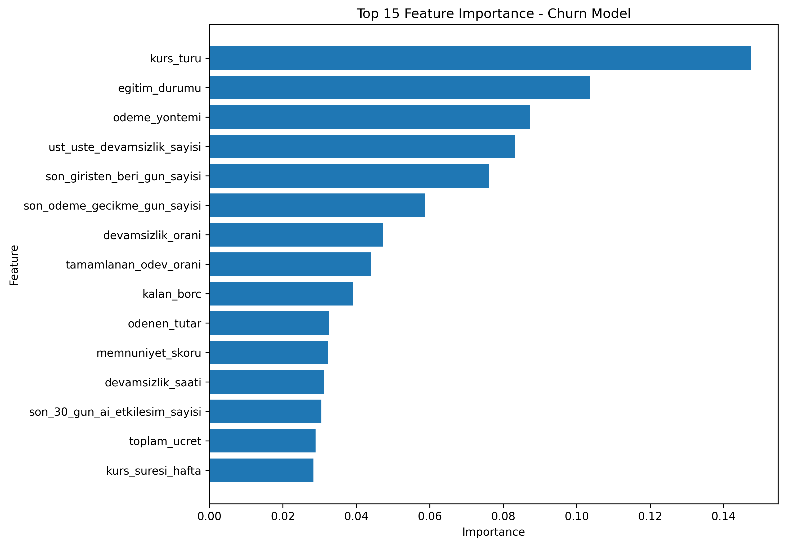
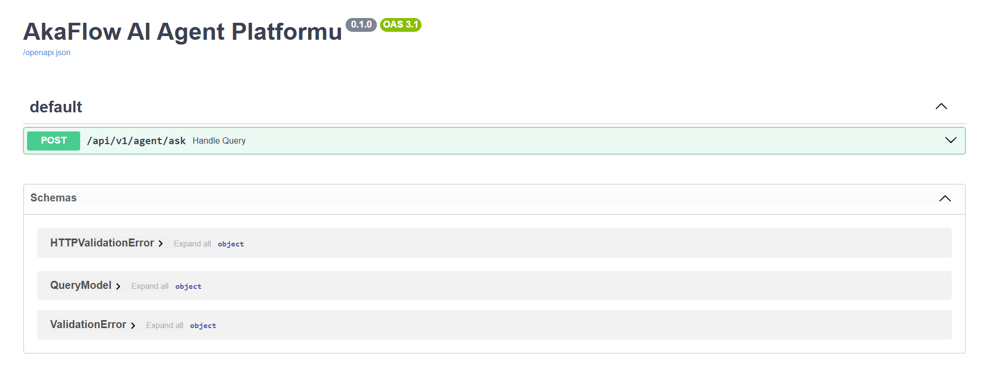
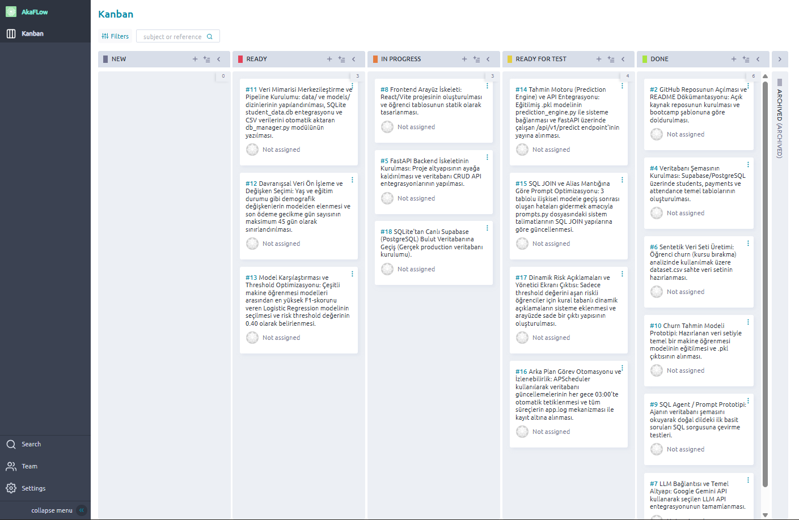
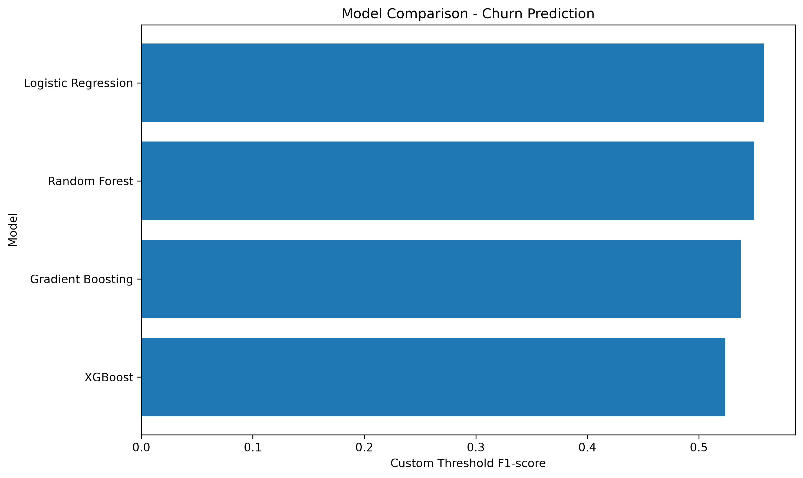
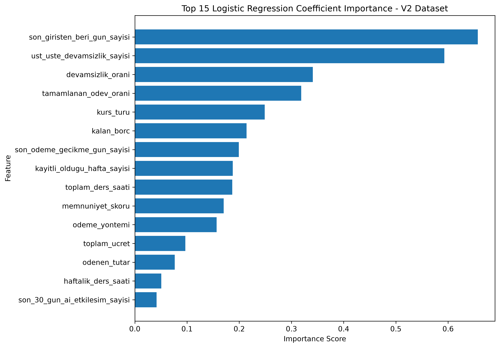
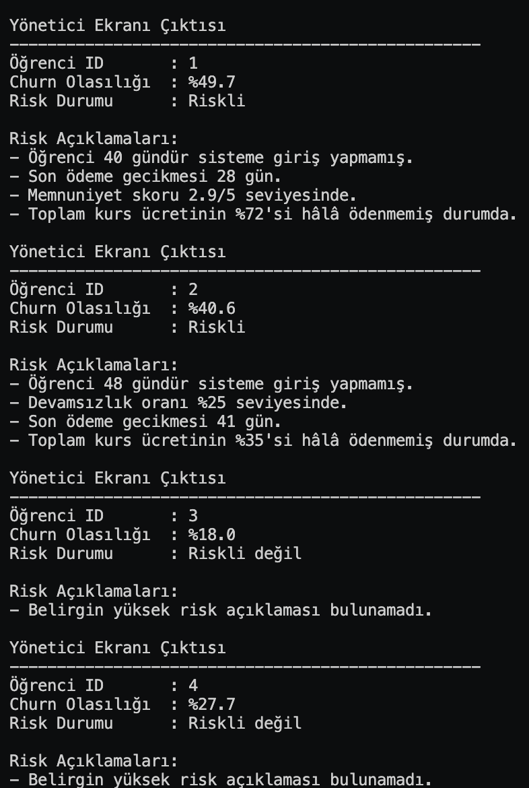

# **Takım İsmi**

Takım 117

# Ürün İle İlgili Bilgiler

## Takım Elemanları

- Ahmet Can Otlu: Scrum Master / Full-Stack Developer
- Nurgül Abut: Product Owner / Data Science Developer
- Ömer Faruk Bütün: Data Science Developer
- Fatma Nisa Paktunç: AI Agent & LLM Developer
- Nida Elvin Mertoğlu: AI Agent & LLM Developer

## Ürün İsmi

AkaFlow

## Ürün Açıklaması

- AkaFlow; eğitim akademileri, kurs merkezleri ve butik eğitim kurumları için geliştirilmiş yapay zeka destekli akıllı bir operasyon, ödeme ve devamsızlık yönetim SaaS platformudur. Sistem, geleneksel kurs otomasyonlarından farklı olarak, arka planda çalışan makine öğrenmesi modelleriyle öğrencilerin kursu bırakma (churn) risklerini önceden tahmin eder. Aynı zamanda bünyesindeki hafızalı AI Agent altyapısı sayesinde yöneticilerin ve öğrencilerin finansal/operasyonel verilere doğal dilde erişmesini sağlar.

## Ürün Özellikleri

- Öğrenci ve kursiyer kayıt yönetimi, devamlılık takibi.
- Akademinin ödeme, taksit ve finansal nakit akışı lojistiğinin izlenmesi.
- Devamsızlık ve ödeme alışkanlıklarına göre öğrenci terk (churn) riskinin makine öğrenmesiyle tahmin edilmesi.
- Veritabanıyla entegre, doğal dildeki soruları anlayan ve yanıtlayan AI Agent asistanı.

## Hedef Kitle

- Özel kurslar ve dil okulları
- Yazılım ve teknoloji akademileri
- Butik eğitim merkezleri ve etüt salonları
- Kurs yöneticileri, eğitmenler ve öğrenciler

## Product Backlog URL

[Taiga Backlog Panomuz](https://tree.taiga.io/project/canbmaj7-akaflow/kanban)

---

# Sprint 1

- **Backlog düzeni ve Story seçimleri**: 1. Sprint Backlog'umuz projenin temel altyapısını ayağa kaldıracak en öncelikli işlere (Epic ve Story'lere) göre düzenlenmiştir. Sprint puan planlaması ekibin kapasitesini aşmayacak şekilde yapılmış olup, kılavuz kurallarına uygun olarak tek bir Story'nin puanı toplam sprint puanının yarısından az olacak şekilde task'lere bölünmüştür. Taiga panomuzda görev atamaları ve iş süreçleri şeffaf şekilde takip edilmektedir.

- **Daily Scrum**: Zamansal senkronizasyonu optimize etmek ve zamanı verimli kullanmak adına Daily Scrum toplantılarının Slack üzerinden yazılı olarak yapılmasına karar verilmiştir. Günlük ilerlemeler, engeller (blocker) ve yapılacak işler her gün düzenli olarak raporlanmıştır. Rapor örnekleri repo içerisindeki dökümantasyon klasöründe yer almaktadır.

- **Sprint board update**: Sprint 1 sonu güncel Taiga Kanban Board ekran görüntümüz:

- **Ürün Durumu**: 1. Sprint çıktısı olarak projenin teknik temelleri atılmıştır. Bu sprintte **Veri Bilimi** tarafında makine öğrenmesi modelini eğitmek için sentetik veri seti üretilmiş ve bu veriyle ilk tahminleme modeli oluşturulmuştur. **AI Agent** tarafında ise LLM entegrasyonu tamamlanarak doğal dildeki soruları API üzerinden yanıtlayabilen çalışan ilk `/api/v1/agent/ask` endpoint prototipi ayağa kaldırılmıştır. Backend tarafında FastAPI ve veritabanı şemaları kurulmuştur.

  #### Veri Bilimi - Model Özellik Önem Sırası (Feature Importance)
  
  *Eğitilen Churn modelimizde kurs türü, eğitim durumu ve ödeme yöntemi gibi metriklerin öğrencilerin kursa devamlılığı üzerindeki etkisi matematiksel olarak doğrulanmıştır.*

  #### Backend & AI Agent API Arayüzü (Swagger UI)
  
  *AkaFlow AI Agent Platformu üzerinden `/api/v1/agent/ask` endpoint'i aktif olarak sorguları kabul etmektedir.*

- **Sprint Review**: 
Yapılan toplantıda 1. Sprint hedeflerine başarıyla ulaşıldığı görülmüştür. Üretilen sentetik veri setinin doğruluğu ve eğitilen modelin ilk metrikleri (Feature Importance grafiğinde görüldüğü üzere) veri bilimi ekibince doğrulanmıştır. AI Agent'ın FastAPI üzerindeki ilk soru-cevap prototipinin stabil çalıştığı test edilmiştir. Önümüzdeki 2. Sprint için bu ajan yapısının veritabanı şemasına (SQL Agent) bağlanması ve hafıza (memory) yönetiminin entegre edilmesi kararlaştırılmıştır. Sprint Review Katılımcıları: Tüm ekip üyeleri.

- **Sprint Retrospective:**
  - Full-stack ve altyapı yükünün dengelenmesi adına sonraki sprintlerde frontend entegrasyonlarına daha fazla kaynak ayrılması kararlaştırılmıştır.
  - Veri bilimi ekibinin eğittiği modelin backend API ile entegrasyon senaryoları şimdiden netleştirilmiştir.
  - Daily Scrum yazışmalarının netliği ve takım içi teknik iletişim hızı oldukça verimli bulunmuş, aynı düzende devam edilmesine karar verilmiştir.

---

# Sprint 2

- **Backlog düzeni ve Story seçimleri**: 2. Sprint döneminde projemizin veri tutarlılığı, model doğruluğu ve AI Agent entegrasyon derinliği hedeflenmiştir. İlk sprintte atılan teknik temellerin üzerine veri pipeline süreçleri, otomatik arka plan görevleri ve gelişmiş prompt mühendisliği hikayeleri önceliklendirilmiştir. Puanlama dengesi korunarak işler alt görevlere (task) kırılmış ve Taiga Kanban panosu üzerinde dinamik olarak yönetilmiştir.

- **Daily Scrum**: Takım içi senkronizasyonu sürdürmek adına Daily Scrum seansları Slack kanalı üzerinden yazılı olarak yürütülmeye devam etmiştir. Bu süreçte backend-AI entegrasyonu ve veritabanı normalizasyon adımlarında karşılaşılan yapısal engeller (blocker) anlık iletişimle hızlıca çözülmüştür. İlgili yazışma ve toplantı günlükleri dökümantasyon klasörümüzde arşivlenmiştir.

- **Sprint board update**: Sprint 2 sonu güncel Taiga Kanban Board ekran görüntümüz:

- **Ürün Durumu**: 2. Sprint sonunda AkaFlow platformu operasyonel ve analitik açıdan uçtan uca çalışır bir yapıya bürünmüştür. 
  
  **1. Veri Mimarisi ve Pipeline:** Proje hiyerarşisi `data/` ve `models/` dizinleriyle standartlaştırılmıştır. `student_data.db` (SQLite) veri tabanı mimarisine geçilmiş, `db_manager.py` ile `student_churn_dataset_v2.csv` verilerinin veritabanına otomatik aktarımı sağlanmıştır. `students`, `payments` ve `attendance` tabloları `ogrenci_id` üzerinden tam ilişkisel hale getirilmiştir.
  
  **2. Veri Bilimi ve Tahmin Motoru:** Mevcut veri setindeki kurs süresi ve haftalık ders saati değişkenleri birbiriyle daha tutarlı olacak şekilde güncellenmiştir. Devamsızlık oranı ile üst üste devamsızlık sayısı arasındaki tutarsızlıklar giderilmiştir. Düzenlenen yeni veri seti farklı makine öğrenmesi modelleri üzerinde yeniden test edilmiştir. Model eğitiminde yaş ve eğitim durumu gibi demografik veriler çıkarılarak tamamen davranışsal ve operasyonel sinyallere odaklanılmıştır. Random Forest, Gradient Boosting ve XGBoost modelleri arasından en yüksek F1-Skor performansını gösteren **Logistic Regression** nihai model olarak seçilmiş ve risk sınıflandırma threshold değeri **0.40** olarak belirlenmiştir. `prediction_engine.py` modülü sisteme entegre edilerek `/api/v1/predict` endpoint'i üzerinden dış dünyaya açılmıştır.
  
  **3. AI Agent ve Prompt Optimizasyonu:** 3 tablolu ilişkisel veri yapısına geçiş sonrası ortaya çıkan sorgu hataları, `prompts.py` içindeki sistem talimatlarının SQL JOIN ve tablo alias mantığına göre optimize edilmesiyle giderilmiştir. Chatbot'un veri sözlüğünde bulunmayan verileri sorgulayarak boş yanıt dönmesi engellenmiştir.
  
  **4. Otomasyon ve Yönetici Ekranı:** APScheduler (`scheduler.py`) entegrasyonu ile veritabanı güncellemeleri her gece 03:00'te otomatikleşmiştir. Riskli olarak işaretlenen öğrenciler için kural tabanlı dinamik risk açıklamaları sisteme dahil edilmiş; yönetici arayüzünde sade bir çıktı yapısı (Churn Olasılığı + Risk Durumu + Risk Açıklamaları) oluşturulmuştur. Tüm süreçler `app.log` mekanizması ile kayıt altına alınmaktadır.

  #### Veri Bilimi - Model Karşılaştırma Grafiği (F1-Score Comparison)
  
  *Threshold optimizasyonları sonucunda en kararlı sınıflandırma performansını sunan Logistic Regression modeli tercih edilmiştir.*

  #### Model Katsayı Önem Sıralaması (Coefficient Importance - V2 Dataset)
  
  *Logistic Regression model katsayılarına göre öğrencilerin terk (churn) riskini en çok tetikleyen unsurların "son girişten beri geçen gün sayısı" ve "üst üste devamsızlık sayısı" olduğu matematiksel olarak kanıtlanmıştır.*

  #### Yönetici Ekranı Dinamik Terminal Çıktısı (Risk Analizi ve Açıklamaları)
  
  *Threshold değerini aşan riskli öğrenciler için kural tabanlı üretilen aksiyonel ve şeffaf risk açıklamalarının çıktısı.*

- **Sprint Review**: 
Gerçekleştirilen Sprint Review toplantısında veri bilimi ekibinin model seçim başarısı ve katsayı analizleri incelenmiş, threshold optimizasyonunun iş mantığına tam oturduğu görülmüştür. AI Agent tarafında prompt'ların SQL JOIN yapılarıyla iyileştirilmesi sonucu veri çekme başarısının %100'e ulaştığı ve tahmin motorundaki 500 hatalarının tamamen giderildiği (200 OK) doğrulanmıştır. Gelecek sprint için sistem sürekliliğini korumak adına planlanan teknik geliştirmeler onaylanmıştır. Katılımcılar: Tüm ekip üyeleri.

- **Sprint Retrospective:**
  - `config.py` modülüne geçilerek hard-coded konfigürasyonların ve dağınık yapıların merkezi hale getirilmesi kod kalitemizi ciddi ölçüde artırmıştır.
  - 3 tablolu ilişkisel modele geçiş esnasında yaşanan entegrasyon sancıları, veri sözlüğü (data dictionary) testlerinin erken yapılmasının önemini göstermiştir.
  - Gelecek sprintlerde servis sürekliliğini garanti altına almak adına **API Key Rotasyonu (Round Robin)** ve **Exponential Backoff tabanlı Hata Yönetimi (Retry Logic)** mimarilerinin 3. Sprint planına dahil edilmesine karar verilmiştir.

---

# Sprint 3

